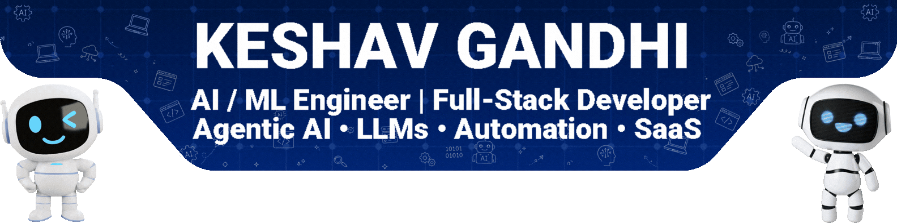

<div align="center" style="margin:0; padding:0; line-height:0;">
  
</div>
<!-- 📊 STATS ROW -->
<p align="center">
  <a href="https://github.com/thekeshavgandhi-dev">
    
  </a>
  <a href="https://github.com/yourusername?tab=followers">
    
  </a>
  <a href="https://github.com/yourusername">
    
  </a>
</p>

<!-- ============ ROW 1: SOCIAL (Long Line) ============ -->
<p align="center">
  <a href="https://linkedin.com/in/thekeshavgandhi"></a>
  <a href="https://x.com/thekeshavgandhi"></a>
  <a href="https://instagram.com/thekeshavgandhi.dev"></a>
  <a href="https://threads.net/@thekeshavgandhi.dev"></a>
  <a href="https://youtube.com/@thekeshavgandhi.dev"></a>
  <a href="https://peerlist.io/thekeshavgandhi"></a>
</p>

<!-- ============ ROW 2: CONNECT (Email, Chats, Teams) ============ -->
<p align="center">
  <a href="mailto:thekeshavgandhi.dev@gmail.com"></a>
  <a href="https://discord.gg/thekeshavgandhi"></a>
  <a href="https://t.me/thekeshavgandhi"></a>
  <a href="https://teams.microsoft.com/thekeshavgandhi"></a>
</p>

<!-- ============ ROW 3: DEV & BLOGGING ECOSYSTEM ============ -->
<p align="center">
  <a href="https://kaggle.com/thekeshavgandhi"></a>
  <a href="https://dev.to/thekeshavgandhi-dev"></a>
  <a href="https://medium.com/thekeshavgandhi.dev"></a>
  <a href="https://hashnode.com/thekeshavgandhi-dev"></a>
  <a href="https://stackoverflow.com/users/thekeshavgandhi.dev"></a>
  <a href="https://yourblog.com/thekeshavgandhi.dev"></a>
</p>

<!-- ============ ROW 4: WORK / SUPPORT (Long Line) ============ -->
<p align="center">
  <a href="https://thekeshavgandhi.is-a.dev"></a>
  <a href="https://github.com/sponsors/thekeshavgandhi-dev"></a>
  <a href="https://stripe.com/thekeshavgandhi"></a>
  <a href="https://producthunt.com/@thekeshavgandhi"></a>
</p>

    


<div align="center">
  <a href="https://git.io/streak-stats">
    
  </a>
</div>
---
<picture>
  <source media="(prefers-color-scheme: dark)" srcset="github-contribution-animation-dark.svg" />
  
</picture>
---

# 🎮 Fun Zone

### Coding Mood

```text
☕ Coffee → Code → Build → Deploy → Repeat
```

### Current Status

```text
Building the future with AI.
```

### Random Dev Quote

> First solve the problem.
> Then write the code.

---

# 💡 Vision

Building India's next generation AI-first technology company.

⭐ If you like my work, follow my journey.


Dono profiles ka positioning alag rakhega to personal brand zyada strong lagega.
```
