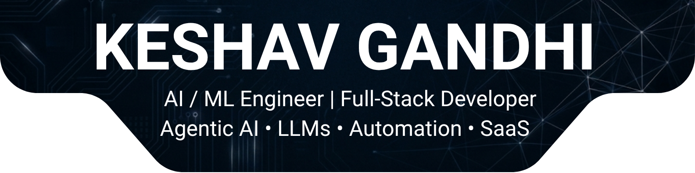

<div align="center" style="margin:0; padding:0; line-height:0;">
  
</div>
<p align="center">
  <a href="https://github.com/AbdullahBakir97"></a>
  <a href="https://github.com/AbdullahBakir97?tab=followers"></a>
  <a href="https://github.com/AbdullahBakir97"></a>
  <a href="https://codetime.dev"></a>
</p>

<!-- 🏷️ PROFESSIONAL BADGES — contact / availability row -->
<p align="center">
  <a href="mailto:abdullah.bakir.1997@gmail.com"></a>
  <a href="https://www.linkedin.com/in/abdullah-bakir-809065273/"></a>
  <a href="https://t.me/BlackSea0011"></a>
  <a href="https://github.com/AbdullahBakir97"></a>
</p>

<div align="center">
  
</div>
<p align="center">
  <a href="https://thekeshavgandhi.dev">
    
  </a>

  <a href="https://linkedin.com/in/YOUR-LINKEDIN">
    
  </a>

  <a href="https://youtube.com/@YOURCHANNEL">
    
  </a>

  <a href="https://instagram.com/thekeshavgandhi.dev">
    
  </a>
</p>

---
<h2 id="contributions" align="center">🐍 Contribution Graph</h2>


# 👨‍💻 About Me

```yaml
Name: Keshav Gandhi
Role: Full-Stack Developer & AI Engineer
Location: India 🇮🇳
Company: Techarvel Ltd
Mission: Building impactful AI & SaaS products

Currently Building:
  - AI SaaS Products
  - Startup Ecosystem
  - Full-Stack Applications

Learning:
  - Advanced AI Engineering
  - System Design
  - Cloud Architecture
  - Machine Learning
````


### Languages

<p>

</p>

### Frontend

<p>

</p>

### Backend

<p>

</p>

### Mobile

<p>

</p>

### AI / ML

<p>

</p>

* Machine Learning
* Deep Learning
* LLMs
* Prompt Engineering
* RAG
* AI Agents
* Computer Vision
* NLP
* Generative AI

### Databases

<p>

</p>

### Cloud & DevOps

<p>

</p>

---

# 🧠 AI Stack

✔ OpenAI

✔ Claude

✔ Gemini

✔ LangChain

✔ CrewAI

✔ Vector Databases

✔ AI Agents

✔ RAG Systems

✔ Automation Workflows

✔ N8N

✔ MCP

✔ LLM Applications

---

# 🏢 Ventures

### 🚀 Techarvel Ltd

Building innovative technology products.

### 🧪 Techarvel Labs

Research, AI & Innovation.

### 🎬 Techarvel Studios

Digital Experiences & Product Design.

---

# 🌐 Connect With Me

<p align="center">

<a href="YOUR-LINKEDIN">
LinkedIn
</a> •

<a href="YOUR-PORTFOLIO">
Portfolio
</a> •

<a href="YOUR-YOUTUBE">
YouTube
</a> •

<a href="YOUR-INSTAGRAM">
Instagram
</a> •

<a href="YOUR-TWITTER">
Twitter/X
</a> •

<a href="YOUR-KAGGLE">
Kaggle
</a> •

<a href="YOUR-DEVTO">
Dev.to
</a> •

<a href="YOUR-MEDIUM">
Medium
</a>

</p>

---

# 📈 GitHub Analytics

<p align="center">

</p>

<p align="center">

</p>

<p align="center">

</p>

---

# 🏆 GitHub Trophies

<p align="center">

</p>

---

# 🐍 Contribution Snake

<p align="center">

</p>

---

# 🎮 Fun Zone

### Coding Mood

```text
☕ Coffee → Code → Build → Deploy → Repeat
```

### Current Status

```text
Building the future with AI.
```

### Random Dev Quote

> First solve the problem.
> Then write the code.

---

# 💡 Vision

Building India's next generation AI-first technology company.

⭐ If you like my work, follow my journey.


Dono profiles ka positioning alag rakhega to personal brand zyada strong lagega.
```
