<!--
============================================================
  FILE: README.md (GitHub Profile)
  AUTHOR: Keshav Gandhi
  DESCRIPTION: Professional GitHub profile README with
               social links, tech stack, stats, and more.
  THEME: Blue (#0A66C2) accent with dark background
============================================================
-->

<!-- ==========================================================
     SECTION 1: HERO BANNER
     Displays the main profile banner image.
     ========================================================== -->

    

<!-- ==========================================================
     SECTION 2: STATS ROW
     Shows profile views, followers, and total stars.
     All badges use the brand blue (#0A66C2) for consistency.
     ========================================================== -->

    <!-- Profile view counter from komarev.com -->
    
    <!-- GitHub followers count -->
    
    <!-- Total stars earned on repositories -->
    

<!-- ==========================================================
     SECTION 3: SOCIAL LINKS (Row-1)
     Professional social platforms where I'm active.
     ========================================================== -->

    
    
    
    
    
    

<!-- ==========================================================
     SECTION 4: CONNECT LINKS (Row-2)
     Direct communication channels: Email, Discord, Telegram, Teams.
     ========================================================== -->

    
    
    
    

<!-- ==========================================================
     SECTION 5: DEV & BLOGGING ECOSYSTEM (Row-3)
     Platforms where I share code, write articles, and engage
     with the developer community.
     ========================================================== -->

    
    
    
    
    
    

<!-- ==========================================================
     SECTION 6: WORK & SUPPORT (Row-4)
     Portfolio, sponsorship, payment, and product discovery.
     ========================================================== -->

    
    
    
    

<!-- Decorative gradient divider line -->

<!-- ==========================================================
     SECTION 7: ABOUT ME
     SVG graphic introducing myself.
     ========================================================== -->

<!-- ==========================================================
     SECTION 8: TECH STACK HEADER
     Styled label for the technology stack section.
     ========================================================== -->

    
    
    

<!-- Tech stack SVG graphic -->

<!-- ==========================================================
     SECTION 9: GITHUB STATS HEADER
     Label for the GitHub statistics section.
     ========================================================== -->

    
    
    

<!-- ==========================================================
     SECTION 10: STREAK & CARTOON
     Left: GitHub streak graph from git-streak-stats.
     Right: A fun coding cartoon illustration.
     ========================================================== -->

    <!-- GitHub streak statistics (left) -->
    &nbsp;&nbsp;&nbsp;&nbsp;&nbsp;&nbsp;&nbsp;&nbsp;&nbsp;&nbsp;&nbsp;&nbsp;
    <!-- Coding cartoon illustration (right) -->
    

<!-- Decorative divider -->

<!-- ==========================================================
     SECTION 11: CONTRIBUTION ANIMATION
     Snake-style contribution grid animation.
     Light mode / Dark mode aware via <picture> element.
     ========================================================== -->
<picture>
    <!-- Dark mode version -->
    <source media="(prefers-color-scheme: dark)" srcset="assets/thekeshavgandhi-dev-contribution-animation-dark.svg" />
    <!-- Light mode version (fallback) -->
    
</picture>

<!-- Decorative divider -->

<!-- ==========================================================
     SECTION 12: ACTIVITY GRAPH
     Dynamic GitHub activity graph from
     github-readme-activity-graph.vercel.app
     Shows commit, PR, and issue activity over time.
     ========================================================== -->

    

<!-- ==========================================================
     SECTION 13: FOOTER
     Waving capsule-style footer with a thank-you message.
     Uses capsule-render.vercel.app for the wave effect.
     ========================================================== -->

